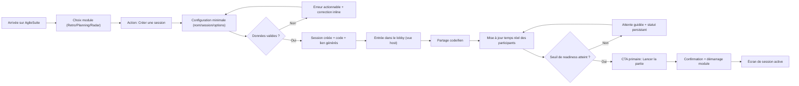
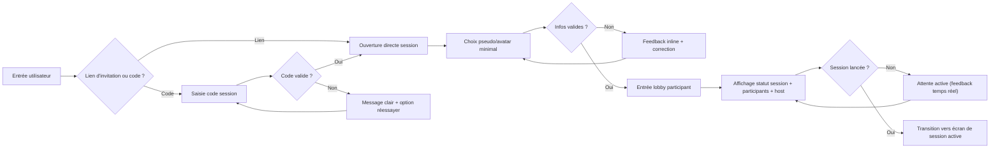
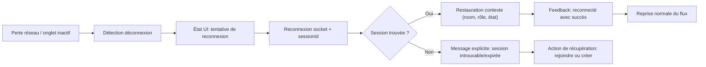

# Spécification UX - retro-party-dev

**Auteur:** Karl FURGEROT  
**Date:** 2026-04-13

---

<!-- Le contenu UX sera enrichi pas à pas pendant le workflow collaboratif -->

## Executive Summary

### Project Vision

AgileSuite vise à transformer les cérémonies Agile en expériences collaboratives fluides, engageantes et mémorables. La proposition UX combine efficacité d'outil professionnel et codes d'interaction inspirés du jeu pour améliorer la participation, la lisibilité et la qualité des échanges en équipe.

### Target Users

Les utilisateurs principaux sont les facilitateurs Agile (Scrum Masters, Product leaders, coaches) et leurs équipes, avec des niveaux de technicité hétérogènes. Le produit doit fonctionner sans friction pour des groupes en présentiel, hybride ou remote, sur desktop et mobile.

### Key Design Challenges

1. Assurer une cohérence UX/UI forte entre Retro Party, Planning Party et Radar Party tout en conservant des identités de module lisibles.
2. Simplifier les parcours temps réel (création, invitation, lobby, lancement, reconnexion) pour réduire les erreurs et l'hésitation.
3. Maintenir une interface visuellement riche (style neon/gamifié) sans dégrader la lisibilité, la hiérarchie de l'information et l'accessibilité.

### Design Opportunities

1. Structurer un socle d'expérience commun AgileSuite (navigation, statuts, CTA, feedback, états vides/chargement/erreur) décliné par module.
2. Capitaliser sur le langage visuel Figma (hero clair, cartes modules, onboarding progressif, lobby orienté action) pour améliorer la perception de valeur dès l'accueil.
3. Renforcer la sensation de session vivante via signaux d'état explicites (présence joueurs, capacité, progression, prochaine action), avec une ergonomie mobile-native.

## Core User Experience

### Defining Experience

L'expérience cœur d'AgileSuite est un parcours de facilitation en temps réel: créer ou rejoindre une session, comprendre immédiatement l'état du groupe, puis lancer l'activité au bon moment.
L'action la plus critique à rendre parfaite est: **entrer en session et atteindre un lobby prêt au lancement sans friction**.

### Platform Strategy

- Plateforme principale: **Web responsive** (desktop prioritaire facilitateur, mobile prioritaire participants).
- Modèle d'interaction: mix **souris/clavier** et **touch** avec mêmes repères visuels.
- Contraintes clés: compatibilité desktop/mobile, robustesse temps réel, cohérence inter-modules.
- Pas de dépendance à l'offline pour le flux principal; priorité à la résilience réseau/reconnexion.

### Effortless Interactions

- Créer/rejoindre une session en moins de 30 secondes.
- Copier/partager code et lien d'invitation en un geste.
- Comprendre instantanément: nombre de participants, statut lobby, prochaine action possible.
- Reprendre la session après perte réseau sans perdre le contexte utilisateur.
- Réduire la charge cognitive: une seule action primaire visible par écran.

### Critical Success Moments

- Premier succès: l'utilisateur atteint le lobby et voit immédiatement comment inviter/lancer.
- Moment "this is better": un joueur rejoint, la présence s'actualise en temps réel, et la progression de session devient évidente.
- Moment de confiance: le facilitateur lance la partie sans ambiguïté d'état.
- Point de rupture à éviter: confusion sur "qui peut faire quoi" (host vs participant) et sur l'état de la session.

### Experience Principles

1. **Lobby-first clarity**: chaque écran doit rendre explicites statut, participants, action suivante.
2. **One primary action**: une CTA dominante par étape, sans concurrence visuelle.
3. **Real-time confidence**: toute info de présence/progression doit paraître fiable et immédiate.
4. **Frictionless onboarding**: rejoindre une session doit demander le minimum d'effort cognitif et d'input.
5. **Unified shell, modular identity**: structure UX commune AgileSuite, accents visuels propres à chaque module.

## Desired Emotional Response

### Primary Emotional Goals

- **Sentiment principal:** se sentir **en contrôle et aligné** avec l'équipe, sans effort inutile.
- **Sentiment différenciant:** ressentir une **énergie collective positive** (engagement, dynamique, envie de participer) plutôt qu'une simple exécution d'outil.
- **Après la tâche clé:** ressentir **accomplissement et clarté** ("on a avancé concrètement ensemble").

### Emotional Journey Mapping

- **Découverte (landing):** curiosité + crédibilité ("c'est pro, vivant, et simple à adopter").
- **Entrée en session (onboarding/config):** confiance + simplicité ("je sais quoi faire maintenant").
- **Lobby et temps réel:** connexion sociale + maîtrise ("on voit le groupe vivre, on est prêts").
- **Lancement et exécution:** fluidité + momentum ("ça s'enchaîne naturellement").
- **Retour ultérieur:** familiarité + efficacité ("je retrouve mes repères immédiatement").
- **En cas de problème (réseau/erreur):** sécurité psychologique ("je peux récupérer la main sans panique").

### Micro-Emotions

Prioritaires:
- Confiance > doute
- Clarté > confusion
- Engagement > passivité
- Satisfaction collective > frustration individuelle
- Appartenance > isolement

À éviter explicitement:
- Anxiété liée au temps réel
- Impression de "perdre le fil"
- Surcharge visuelle qui masque l'action principale

### Design Implications

- **Confiance** → états système explicites (session, joueurs connectés, host, prochaine action).
- **Clarté** → une CTA primaire par écran, texte d'action orienté résultat.
- **Engagement** → feedback temps réel visible (arrivées joueurs, progression, readiness).
- **Sérénité en incident** → messages de récupération concrets (reconnexion, reprise, statut courant).
- **Accomplissement** → confirmations courtes et positives sur les transitions importantes (session créée, lobby prêt, activité lancée).

### Emotional Design Principles

1. **Visible control:** l'interface doit toujours répondre "où j'en suis, qui est là, que faire ensuite".
2. **Collective momentum:** chaque interaction importante doit renforcer la sensation de progression d'équipe.
3. **Low-anxiety real-time:** le temps réel doit être ressenti comme rassurant, jamais chaotique.
4. **Expressive but legible:** style fort autorisé, mais jamais au détriment de la compréhension immédiate.
5. **Recovery by design:** chaque erreur potentielle doit proposer une sortie claire et rapide.

## UX Pattern Analysis & Inspiration

### Inspiring Products Analysis

Source principale d'inspiration: maquette Figma AgileSuite (`59:2`).

Patterns observés:
- Landing orientée valeur avec promesse claire + CTA principal unique.
- Présentation modulaire (Retro / Planning / Radar) avec structure homogène et bénéfices lisibles.
- Parcours guidé par étapes (header avec progression Accueil → Config → Lobby).
- Lobby comme centre d'orchestration: code session, lien d'invitation, présence joueurs, statut prêt/non prêt, action de lancement.
- Design émotionnel maîtrisé: univers visuel engageant, mais architecture d'information structurée.

### Transferable UX Patterns

- **One-screen / one-primary-action**: une action dominante par écran.
- **Progression explicite**: stepper de parcours pour réduire la charge cognitive.
- **Session clarity block**: bloc fixe avec code, lien, état session, capacité joueurs.
- **Real-time readiness cues**: indicateurs visibles de présence et de progression avant lancement.
- **Module consistency shell**: même squelette UX pour les 3 modules, personnalisation visuelle locale.
- **Action microcopy orientée résultat**: libellés d'action explicites (ex: créer + ouvrir le lobby).

### Anti-Patterns to Avoid

- Multiplication de CTA primaires concurrentes sur un même écran.
- États temps réel implicites (absence d'indication claire host/joueur/session).
- Variations visuelles non contrôlées entre modules qui cassent les repères.
- Flux d'invitation dépendant d'un seul canal (code uniquement ou lien uniquement).
- Surcharge néon qui réduit contraste et lisibilité sur mobile.
- Feedbacks critiques uniquement transient (toast) sans ancrage persistant dans l'UI.

### Design Inspiration Strategy

**What to Adopt**
- Structure de parcours guidé (stepper + retour).
- Lobby orienté orchestration et décision.
- Carte module standardisée avec bénéfices/action immédiate.

**What to Adapt**
- Densité desktop → mobile: compacter blocs session/lobby avec priorisation stricte.
- Univers visuel néon: conserver l'identité, renforcer contrastes fonctionnels.
- CTA et statuts: harmoniser wording et hiérarchie sur les 3 modules.

**What to Avoid**
- Toute interaction qui masque l'état du groupe en temps réel.
- Toute divergence de pattern entre modules sur création/rejoindre/lancer.
- Toute complexité de config exposée trop tôt avant la valeur immédiate.

## Design System Foundation

### 1.1 Design System Choice

Approche retenue: **Themeable System hybride** basé sur l'existant du projet (`shadcn/ui + Radix + Tailwind`) avec une couche de tokens AgileSuite et des variantes visuelles par module (Retro / Planning / Radar).

### Rationale for Selection

- Cette option maximise la vitesse d'implémentation en réutilisant les primitives déjà en production.
- Elle permet de conserver une identité visuelle forte alignée avec la maquette Figma.
- Elle réduit le risque de divergence UX entre modules grâce à un socle commun.
- Elle reste maintenable pour l'équipe actuelle sans refonte technique majeure.

### Implementation Approach

- Conserver les primitives UI existantes comme couche fondation.
- Centraliser les design tokens sémantiques (couleurs, typographie, radius, spacing, shadow, états).
- Introduire un "shell AgileSuite" transversal pour navigation, header, statuts de session, CTA.
- Décliner des variantes de thème par module via tokens et classes utilitaires.
- Standardiser les patterns critiques: onboarding, progression, lobby, feedback temps réel, erreurs/recovery.

### Customization Strategy

- Niveau 1: tokens globaux (identité AgileSuite partagée).
- Niveau 2: tokens de module (accent visuel contrôlé, sans casser les repères).
- Niveau 3: composants composites métier (SessionCard, LobbyStatus, InvitePanel, PrimaryFlowCTA).
- Gouvernance: toute nouvelle variation UI doit d'abord être exprimée en token/pattern avant ajout local.

## 2. Core User Experience

### 2.1 Defining Experience

L'expérience définissante d'AgileSuite est: **Créer (ou rejoindre) une session collaborative, voir immédiatement que l'équipe est prête, puis lancer l'activité avec confiance.**
C'est l'interaction que les utilisateurs décriront: "on ouvre une session, tout le monde rejoint vite, et on démarre sans friction".

### 2.2 User Mental Model

Les utilisateurs pensent en séquence simple:
1. "Je veux lancer un rituel rapidement."
2. "Je dois inviter les bonnes personnes."
3. "Je dois vérifier que tout le monde est prêt."
4. "Je démarre quand l'état du groupe est clair."

Attentes implicites:
- Les infos critiques sont visibles sans chercher (code, lien, présence, host, état).
- Le système confirme en temps réel ce qui se passe.
- La reprise après aléa réseau ne casse pas le fil.

Sources de confusion à prévenir:
- Qui a le droit de lancer ?
- Session ouverte, en attente ou lancée ?
- Rejoindre via code vs lien: quel chemin prioritaire ?

### 2.3 Success Criteria

Critères de succès du cœur d'expérience:
- Création ou entrée en session en moins de 30 secondes.
- Compréhension immédiate de l'état du lobby (participants, readiness, action suivante).
- Une action primaire claire à chaque étape.
- Feedback temps réel perçu comme fiable (join, reconnect, disponibilité).
- Lancement de session sans hésitation ni erreur de rôle.

Indicateurs UX observables:
- Moins d'abandons avant lobby.
- Moins d'erreurs d'action (mauvais timing, mauvaise action).
- Temps "session créée → activité lancée" réduit.

### 2.4 Novel UX Patterns

Approche recommandée: **patterns établis + combinaison produit originale**.

Patterns établis:
- Stepper de progression.
- CTA primaire unique.
- Cartes d'état et feedbacks persistants.
- Hiérarchie claire des actions host/participant.

Twist AgileSuite:
- Univers visuel gamifié appliqué à des workflows de facilitation pro.
- Lobby-orchestrateur comme pièce centrale inter-modules.
- Cohérence structurelle forte avec identité modulée par module.

### 2.5 Experience Mechanics

**1. Initiation**
- Point d'entrée: landing ou accès direct module.
- Déclencheurs: "Commencer", "Créer une session", "Rejoindre".

**2. Interaction**
- L'utilisateur renseigne le minimum (module, nom/session, mode d'accès).
- Le système génère et expose immédiatement code + lien.
- Les participants rejoignent; la présence se met à jour en direct.

**3. Feedback**
- Signaux persistants: statut session, compteur joueurs, rôle host, disponibilité action.
- Micro-feedbacks: confirmations courtes et explicites.
- En erreur: message actionnable + chemin de récupération.

**4. Completion**
- Le facilitateur lance l'activité depuis un état "prêt".
- L'équipe entre dans le module actif avec continuité visuelle et contextuelle.
- Le système maintient les repères (où on est, quoi faire ensuite).

## Visual Design Foundation

### Color System

- Source de vérité visuelle: **maquette Figma AgileSuite** (guideline de marque principale).
- Direction colorimétrique: base sombre premium avec accents contrôlés.
- Palette sémantique recommandée:
  - `bg/base`: tons nocturnes profonds (fond global, surfaces principales)
  - `surface/elevated`: variantes plus claires pour cartes/panneaux
  - `primary/action`: violet néon (actions principales)
  - `secondary/highlight`: cyan (information active, états focus, data)
  - `accent/module`: orange (signal module/état notable)
  - `success`: vert
  - `warning`: ambre
  - `error`: rouge
- Règle d'usage:
  - 1 couleur d'action primaire par écran
  - accents secondaires réservés au feedback et à la hiérarchie d'état
  - éviter la compétition visuelle entre violet/cyan/orange sur la même zone d'action

### Typography System

- Orientation typographique validée: **plus sobre**.
- Stratégie:
  - Police principale UI: sans-serif moderne, très lisible (navigation, formulaires, contenu).
  - Police accent (optionnelle): usage minimal et contextuel pour identité produit, jamais pour texte long.
- Hiérarchie type:
  - `Display/Hero` (landing)
  - `H1/H2/H3` (titres d'écran et sections)
  - `Body M / Body S` (contenu principal)
  - `Caption` (métadonnées, statuts secondaires)
- Règles de lisibilité:
  - longueurs de ligne maîtrisées
  - interlignage confortable
  - contraste texte/fond prioritaire sur l'effet décoratif

### Spacing & Layout Foundation

- Densité validée: **aérée**.
- Base d'espacement: système 8pt.
- Principes:
  - espaces généreux entre sections majeures
  - regroupement clair des informations par blocs fonctionnels
  - respiration visuelle prioritaire dans onboarding/lobby
- Grille:
  - desktop: grille structurée (12 colonnes) avec zones stables (contenu principal + panneau contexte)
  - mobile: flux mono-colonne, blocs empilés, CTA persistante en bas si pertinent
- Cohérence inter-modules:
  - même structure spatiale de base, variation visuelle contrôlée par tokens module

### Accessibility Considerations

- Objectif validé: **WCAG AA** minimum.
- Exigences:
  - contrastes texte/fond conformes AA
  - états focus visibles et cohérents clavier/touch
  - tailles de texte et zones tactiles adaptées mobile
  - feedbacks non dépendants de la couleur seule (ajouter icône/libellé)
  - messages d'erreur actionnables et contextualisés
- Règle produit:
  - toute nouvelle variation visuelle doit être validée sur contraste + lisibilité avant intégration.

## Design Direction Decision

### Design Directions Explored

8 directions visuelles ont été explorées dans le visualizer HTML, en conservant une architecture UX commune (landing, choix module, lobby orchestration, lancement):
- D1 Dark Neon Clarity
- D2 Midnight Professional
- D3 Lobby Command Center
- D4 Module First Cards
- D5 High Contrast Utility
- D6 Calm Data Glow
- D7 Sprint Energy
- D8 Hybrid Enterprise Game

### Chosen Direction

Direction retenue: **D8 - Hybrid Enterprise Game**  
Direction secondaire utile pour variantes d'écran lobby: **D3 - Lobby Command Center**

### Design Rationale

- D8 offre le meilleur équilibre entre identité AgileSuite (gamifiée) et sobriété professionnelle.
- La lisibilité est forte et compatible avec une densité aérée.
- La direction est compatible avec WCAG AA sans sacrifier l'expressivité.
- Elle s'aligne directement avec la maquette Figma de référence et limite la dérive visuelle entre modules.

### Implementation Approach

- Utiliser D8 comme baseline globale (tokens, hiérarchie, composants transverses).
- Appliquer les patterns d'orchestration de D3 uniquement sur les écrans lobby/session temps réel.
- Conserver une CTA primaire unique par écran et des statuts persistants visibles.
- Décliner les accents par module via tokens, sans changer la structure UX commune.

## User Journey Flows

### Créer et lancer une session (Facilitateur)

Objectif: passer de l'intention "je lance un atelier" à "session active" avec clarté et contrôle.

### Rejoindre une session (Participant)

Objectif: rejoindre rapidement, comprendre l'état, se sentir prêt sans ambiguïté.

### Reconnexion et récupération (Host/Participant)

Objectif: supprimer l'anxiété liée aux coupures réseau et préserver la continuité.

### Journey Patterns

- **One primary action par étape** (réduit l'hésitation).
- **Statut persistant visible** (session, rôle, readiness, prochaine action).
- **Validation inline + message actionnable** (pas d'erreur opaque).
- **Double canal d'entrée session** (code et lien).
- **Temps réel rassurant** (feedback de présence explicite).

### Flow Optimization Principles

- Minimiser les champs avant la valeur (config minimale, progressive disclosure).
- Prioriser les décisions host au bon moment (lancer seulement quand readiness atteinte).
- Éviter les dead-ends: chaque erreur offre un chemin de reprise immédiat.
- Conserver la continuité contextuelle entre écrans (module, session, rôle).
- Optimiser mobile: parcours court, CTA principale persistante, informations critiques en premier.

## Component Strategy

### Design System Components

Composants foundation (issus de `shadcn/ui + Radix`, à conserver comme base):
- Action: `Button`, `Toggle`, `Tabs`, `DropdownMenu`
- Saisie: `Input`, `Textarea`, `Select`, `Checkbox`, `RadioGroup`, `Slider`
- Structure: `Card`, `Separator`, `Sheet`, `Dialog`, `Popover`, `Tooltip`
- Feedback: `Toast`, `Sonner`, `Progress`, `Badge`
- Navigation/organisation: `Breadcrumb`, `NavigationMenu`, `Pagination`

Composants shell déjà en place:
- `PrimaryButton`, `SecondaryButton`, `Card`, `Modal`, `Input`, `SectionHeader`, `LobbyCard`

Gap principal identifié:
- Manque de composants métier unifiés pour les flux host/participant, statuts temps réel et readiness.

### Custom Components

### SessionStatusBar

**Purpose:** afficher l'état global session en permanence (module, état, rôle, connectivité).  
**Usage:** header des écrans onboarding/config/lobby/session.  
**Anatomy:** module badge, session state pill, host/participant role, network indicator.  
**States:** default, connecting, synced, degraded, error.  
**Variants:** compact (mobile), full (desktop).  
**Accessibility:** `aria-live="polite"` pour changements d'état critiques.  
**Content Guidelines:** messages courts orientés action ("En attente de joueurs", "Prêt à lancer").  
**Interaction Behavior:** clic sur état réseau ouvre détails de récupération.

### InvitePanel

**Purpose:** centraliser code + lien + actions de partage.  
**Usage:** lobby host.  
**Anatomy:** code visible, lien tronqué/copiable, actions "Copier code", "Copier lien".  
**States:** ready, copying, copied, error.  
**Variants:** horizontal desktop, stack mobile.  
**Accessibility:** boutons explicites, feedback non uniquement couleur.  
**Interaction Behavior:** feedback immédiat + persistant court (toast + label local).

### LobbyReadinessBoard

**Purpose:** visualiser présence, slots, readiness et seuil de lancement.  
**Usage:** écran lobby tous modules.  
**Anatomy:** grille joueurs, compteurs, indicateur readiness, CTA de lancement (host).  
**States:** waiting, threshold-reached, launching, launched.  
**Variants:** 4/8/20 joueurs.  
**Accessibility:** annonce des changements de participants via zone live discrète.

### FlowStepperHeader

**Purpose:** rendre la progression de parcours explicite (Accueil → Config → Lobby).  
**Usage:** onboarding et création session.  
**Anatomy:** steps, état courant, retour sécurisé.  
**States:** current, completed, upcoming, blocked.  
**Variants:** horizontal desktop, compressed mobile.  
**Accessibility:** `aria-current="step"` sur étape active.

### PrimaryFlowCTA

**Purpose:** garantir "une action primaire claire" par écran.  
**Usage:** bas des écrans clés (create, join, launch).  
**Anatomy:** label orienté résultat + icône + hint secondaire.  
**States:** enabled, disabled with reason, loading, success.  
**Variants:** inline / sticky mobile bottom.  
**Accessibility:** raison du disabled lisible via texte, pas seulement style.

### RecoveryBanner

**Purpose:** réduire anxiété en cas d'aléa temps réel.  
**Usage:** déconnexion/reconnexion/session introuvable.  
**Anatomy:** état, impact, action immédiate ("Réessayer", "Rejoindre").  
**States:** reconnecting, recovered, failed.  
**Accessibility:** priorité visuelle + lisibilité AA + message actionnable.

### Component Implementation Strategy

- Utiliser les primitives design system pour tous les composants custom (pas de divergence de base).
- Encapsuler les comportements temps réel dans composants métier réutilisables.
- Piloter les variations par tokens (`global` puis `module`) plutôt que par styles ad hoc.
- Intégrer accessibilité dès la définition des états (focus, aria, feedback multi-canal).
- Standardiser les microcopies d'état et d'action pour cohérence cross-module.

### Implementation Roadmap

**Phase 1 - Critique parcours**
1. `SessionStatusBar`
2. `InvitePanel`
3. `PrimaryFlowCTA`

**Phase 2 - Orchestration lobby**
4. `LobbyReadinessBoard`
5. `FlowStepperHeader`

**Phase 3 - Résilience et polish**
6. `RecoveryBanner`
7. Harmonisation des variantes module (Retro/Planning/Radar) sur tokens uniquement

## UX Consistency Patterns

### Button Hierarchy

- **Primary CTA**:
  - 1 seule par écran/étape.
  - Libellé orienté résultat (`Créer la session`, `Lancer la partie`, `Rejoindre`).
  - Position stable (desktop: zone principale d'action, mobile: bas d'écran sticky si besoin).
- **Secondary actions**:
  - supportent le flux sans concurrencer la CTA (ex: `Copier le lien`, `Modifier`).
- **Tertiary / text actions**:
  - actions de faible criticité (`Retour`, `Annuler`, `Voir détails`).
- **Danger actions**:
  - style dédié + confirmation explicite pour actions destructrices.
- **Disabled states**:
  - toujours accompagnés d'une raison lisible (pas seulement visuelle).

### Feedback Patterns

- **Success**:
  - feedback immédiat + confirmation concise ("Lien copié", "Session lancée").
  - combinaison recommandée: toast court + statut local persistant.
- **Warning**:
  - signal de blocage non fatal avec action corrective claire.
- **Error**:
  - message actionnable: cause + quoi faire ensuite.
  - éviter les formulations techniques côté utilisateur.
- **Info / realtime**:
  - updates de présence/session via composants persistants (pas uniquement toast).
- **Recovery**:
  - en cas de coupure réseau: bannière de reprise + état de reconnexion visible.

### Form Patterns

- **Progressive disclosure**:
  - afficher d'abord les champs indispensables, options avancées en secondaire.
- **Validation inline**:
  - validation au fil de l'eau + message contextualisé sous le champ.
- **Input ergonomics**:
  - labels explicites, placeholders d'exemple, aide courte si ambiguïté.
- **Submission behavior**:
  - bouton principal en loading state pendant traitement.
  - prévenir les doubles soumissions.
- **Mobile-first form rules**:
  - champs assez hauts/touch-friendly, clavier adapté au type de saisie.

### Navigation Patterns

- **Flow stepper standard**:
  - Accueil → Config → Lobby (et équivalents module), avec `aria-current`.
- **Back navigation sûre**:
  - retour possible sans perte silencieuse de données critiques.
- **Session context always visible**:
  - module actif, rôle, statut session visibles dans le header.
- **Cross-module consistency**:
  - même squelette navigation, variations limitées aux accents de module.
- **Deep-link resilience**:
  - lien session invalide/expiré redirige vers reprise claire.

### Additional Patterns

- **Modal / overlay**:
  - réserver aux confirmations critiques ou actions focalisées.
  - fermer sans surprise; conserver l'état si possible.
- **Empty states**:
  - expliquer l'état + proposer l'action suivante immédiate.
- **Loading states**:
  - skeleton/spinner contextuel, jamais écran figé sans signal.
- **Role clarity patterns**:
  - actions host distinctes des actions participant.
- **Realtime presence patterns**:
  - compteur + avatars + progression readiness comme pattern standard lobby.

## Responsive Design & Accessibility

### Responsive Strategy

- **Desktop (1024+)**
  - Exploiter l'espace avec layout 2 zones: contenu principal + contexte session.
  - Afficher simultanément statut session, présence joueurs, actions de facilitation.
  - Densité aérée, lisibilité prioritaire sur volume d'information.
- **Tablet (768–1023)**
  - Conserver structure desktop simplifiée (colonnes empilables selon priorité).
  - Interfaces touch-first (zones d'action élargies, interactions directes).
  - Réduction des éléments décoratifs non essentiels.
- **Mobile (320–767)**
  - Flux mono-colonne, ordre strict: statut → action primaire → détails secondaires.
  - CTA principale persistante en bas pour étapes critiques.
  - Panneaux contextuels repliables (progressive disclosure) pour éviter surcharge.

### Breakpoint Strategy

- Approche: **mobile-first**.
- Breakpoints recommandés:
  - `sm`: 480px (petits mobiles / confort lecture)
  - `md`: 768px (tablettes et grands mobiles paysage)
  - `lg`: 1024px (desktop)
  - `xl`: 1280px (desktop large, optimisation orchestration)
- Règle:
  - changements de layout uniquement quand ils améliorent la compréhension du flux, pas pour variation cosmétique.

### Accessibility Strategy

- Niveau cible: **WCAG 2.2 AA** (minimum produit).
- Exigences clés:
  - Contraste texte/fond conforme AA.
  - Focus visible et cohérent sur tous les contrôles.
  - Navigation clavier complète sur parcours critiques (create/join/lobby/launch).
  - Cibles tactiles min. 44x44 px.
  - Feedback non dépendant de la couleur seule (icône + texte + état).
  - Support lecteurs d'écran pour statuts session et événements critiques (`aria-live` ciblé).

### Testing Strategy

- **Responsive**
  - Tests sur devices réels (au moins iOS Safari + Android Chrome).
  - Vérification portrait/paysage sur écrans de flux critique.
  - Validation des performances perçues sur réseau dégradé.
- **Accessibilité**
  - Audit automatisé (axe/lighthouse) sur écrans clés.
  - Test clavier-only complet.
  - Test lecteur d'écran (VoiceOver et NVDA) sur parcours session.
  - Vérification contrastes + simulation daltonisme.
- **Régression UX**
  - Checklist dédiée sur host/participant/reconnexion avant release.

### Implementation Guidelines

- Utiliser unités relatives et tokens (pas de dimensions fixes arbitraires).
- Préserver "une CTA primaire par écran" à tous les breakpoints.
- Garder les infos critiques session au-dessus de la ligne de flottaison mobile.
- Encapsuler les patterns responsive dans composants métier (pas dans chaque écran).
- Gérer focus et annonces ARIA dès la conception des composants.
- Définir des critères d'acceptation UX: lisibilité, actionnabilité, recovery.
