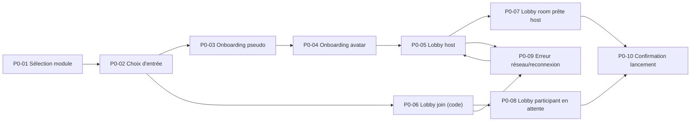

# Plan de prototype interactif - AgileSuite (V1)

Date: 2026-04-13  
Maquette de référence: https://www.figma.com/design/R3n4UCPVs0aTxOjC3Xtntn/Agile-suite?node-id=59-2&p=f&t=ZiQypZVu0HDvmXJe-0  
Scope: flux critique `Accueil -> Onboarding -> Lobby -> Lancement`

## 1) Objectif du prototype

Valider rapidement, avec des utilisateurs réels (host + participant), les hypothèses UX suivantes:

- Le parcours de mise en session est compris sans assistance.
- Les rôles (host/participant) sont lisibles et non ambigus.
- Le lobby donne suffisamment de confiance pour lancer l'activité.
- La version mobile reste fluide et compréhensible.

## 2) Périmètre fonctionnel

Inclure:

- Sélection module.
- Choix d'entrée jouer/préparer.
- Onboarding pseudo/avatar.
- Lobby sans room (host/join).
- Lobby room prête (host et participant).
- États d'erreur critiques (code invalide, serveur indisponible, attente host).

Exclure (V1):

- Flux métier complet in-game (cartes rétro/planning/radar détaillés).
- Gestion compte avancée (auth complète, reset password finalisé).

## 3) Inventaire des frames à créer (Figma)

Convention nommage:

- `P0-XX` pour desktop (1440x1024)
- `P1-XX` pour mobile (390x844)

Liste:

1. `P0-01` Landing + sélection d'expérience
2. `P0-02` Choix d'entrée jouer/préparer
3. `P0-03` Onboarding pseudo
4. `P0-04` Onboarding avatar
5. `P0-05` Lobby sans room (mode host)
6. `P0-06` Lobby sans room (mode join + code invalide)
7. `P0-07` Lobby room prête (vue host)
8. `P0-08` Lobby room prête (vue participant en attente)
9. `P0-09` État erreur réseau/reconnexion
10. `P0-10` Confirmation lancement
11. `P1-01` à `P1-10` miroir mobile des frames ci-dessus

## 4) Cartographie des interactions

## 5) Hotspots et comportements par frame

### `P0-01` Landing + sélection

- Clic carte module -> active l'état sélection + active CTA `Continuer`.
- Clic `Continuer` -> `P0-02`.
- Clic `Retour` -> écran précédent (ou no-op si premier écran).

### `P0-02` Choix d'entrée

- Clic `Jouer` ou `Préparer` -> sélection visuelle.
- `Suivant`:
  - si `Jouer` -> `P0-03`
  - si `Préparer` -> `P0-05` (ou prototype annexe Prepare)

### `P0-03` Onboarding pseudo

- Champ pseudo:
  - <2 caractères: CTA désactivée + message aide.
  - >=2 caractères: CTA activée.
- `Suivant` -> `P0-04`.
- `Retour` -> `P0-02`.

### `P0-04` Onboarding avatar

- Clic avatar -> met à jour preview profil.
- `Continuer` -> `P0-05`.
- Si état `connecting`: CTA désactivée.

### `P0-05` Lobby host sans room

- Toggle `Host/Join`.
- `Host + Suivant` -> `P0-07`.
- `Join + code invalide` -> `P0-06`.
- `Retour` -> `P0-04`.

### `P0-06` Lobby join (code invalide)

- Saisie code correct -> `P0-08`.
- État erreur persistant tant que code invalide.

### `P0-07` Lobby room prête host

- `Copier code` -> microfeedback `Copié`.
- Slider rounds -> valeur live.
- `Lancer la partie` -> `P0-10`.
- `Annuler session` -> modal confirmation (optionnel frame overlay).

### `P0-08` Lobby participant attente

- Affiche `En attente de l'host`.
- `Quitter` -> `P0-02`.
- Transition simulée auto vers `P0-10` (si host lance).

### `P0-09` Erreur réseau/reconnexion

- Bannière reconnecting.
- Action `Réessayer`:
  - succès -> retour `P0-05` ou `P0-07`.
  - échec -> reste sur `P0-09`.

### `P0-10` Confirmation lancement

- Écran de transition vers module actif.
- CTA finale: `Entrer dans la session`.

## 6) Variables de prototype Figma (recommandé)

Créer un set `prototypeState`:

- `device`: `desktop | mobile`
- `role`: `host | participant`
- `mode`: `create | join`
- `network`: `ok | reconnecting | error`
- `roomState`: `none | ready | started`
- `validation`: `valid | invalid`

Utilisation:

- Brancher variants ou overlays via ces variables pour réduire duplication.

## 7) Règles de transitions

- Navigation primaire: `Instant` ou `Smart Animate` 150-200ms.
- Ouverture modales: `Move in` (bottom) 180ms.
- Feedback copie: switch variant `default -> copied` 120ms.
- Ne pas multiplier les animations décoratives: focus lisibilité.

## 8) Couverture responsive du prototype

- Chaque frame desktop a son miroir mobile.
- Priorité mobile:
  - sticky action bar visible,
  - information critique au-dessus du fold,
  - sections secondaires repliées.
- Vérifier alignement logique desktop/mobile sur les mêmes scénarios.

## 9) Script de test utilisateur (prototype)

Scénario A (Host):

1. Choisir un module.
2. Créer une session.
3. Finaliser pseudo + avatar.
4. Inviter via code.
5. Lancer la partie.

Scénario B (Participant):

1. Rejoindre via code.
2. Corriger un code invalide.
3. Observer l'attente host.
4. Vérifier la transition au lancement.

Scénario C (Résilience):

1. Simuler perte réseau.
2. Utiliser action de reconnexion.
3. Confirmer retour au bon état.

## 10) Critères de validation (Definition of Done prototype)

- Tous les hotspots critiques sont cliquables sur desktop et mobile.
- Les états invalides/erreur sont représentés.
- Les rôles host/participant sont testables sans ambiguïté.
- Les microcopies d'action sont cohérentes avec la spec UX.
- Le prototype peut être utilisé pour un test modéré de 20 minutes.

## 11) Handoff vers implémentation

- Lier chaque frame du prototype à son écran code:
  - `P0-01/02` -> `Home.tsx`
  - `P0-03/04` -> `OnlineOnboardingScreen.tsx`
  - `P0-05..09` -> `OnlineLobbyScreen.tsx`
  - `P0-10` -> écran de transition à créer/ajuster
- Exporter une checklist par écran:
  - layout validé,
  - états validés,
  - accessibilité validée (focus, contraste, labels).

## 12) Vérifications manuelles

1. Cliquer tout le flux host desktop sans blocage.
2. Cliquer tout le flux participant mobile sans blocage.
3. Vérifier la présence d'au moins un état erreur et un état recovery.
4. Vérifier qu'aucun écran n'expose plus d'une action primaire.
5. Vérifier cohérence wording FR sur CTA/statuts.

